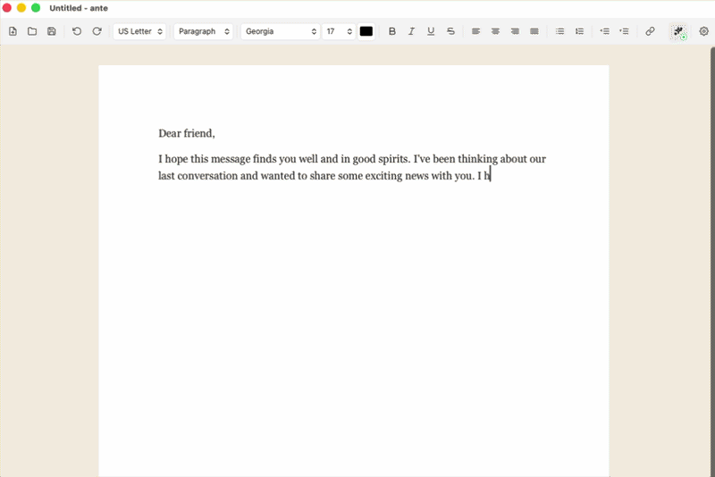

<p align="center">
  
</p>

<h1 align="center">ANTE - AI Native Text Editor</h1>

<p align="center"><em>Write well. Without the bloat.</em></p>

Since creating software has become cheap and AI has become genuinely amazing, why not attack the big boss - Micro\*\*\*\* - with its own tools? Why pay a monthly subscription for a word processor when we can build one ourselves that is better, leaner, and less cluttered?

That is the idea behind **ante**: a small, fast, desktop writing app. Pages on a canvas. A toolbar you actually understand. AI ghost-autocompletion built in from day one. No ribbon. No telemetry. No login wall. No 300MB installer that wants admin rights.

It is not trying to be Word. It is trying to be the thing you reach for when you want to just write.

<p align="center">
  
</p>

## Download

All download buttons point to the latest release page; pick the file for your platform there.

[](https://github.com/willhama/ante/releases/latest)
[](https://github.com/willhama/ante/releases/latest)
[](https://github.com/willhama/ante/releases/latest)

[All releases](https://github.com/willhama/ante/releases)

Builds are currently unsigned. You will need to bypass Gatekeeper / SmartScreen on first launch.

### Install on macOS

1. Download `ante-macOS-AppleSilicon.dmg` (M1/M2/M3/M4 Macs) or `ante-macOS-Intel.dmg` (older Intel Macs).
2. Open the `.dmg` and drag `ante.app` to your Applications folder.
3. Because the build is unsigned, macOS will refuse to open it on first launch ("ante is damaged and can't be opened"). Remove the quarantine flag from Terminal:
   ```bash
   xattr -dr com.apple.quarantine /Applications/ante.app
   ```
4. Launch ante from Applications. Subsequent launches work normally.

### Install on Windows

1. Download `ante-Windows-x86_64-Setup.exe` (recommended) or `ante-Windows-x86_64.msi`.
2. Double-click to run. SmartScreen will show "Windows protected your PC".
3. Click **More info**, then **Run anyway**.
4. Follow the installer prompts. ante is added to your Start menu.

### Install on Linux

1. Download `ante-Linux-x86_64.AppImage` (portable) or `ante-Linux-x86_64.deb` (Debian/Ubuntu).
2. **AppImage**: make it executable and run.
   ```bash
   chmod +x ante-Linux-x86_64.AppImage
   ./ante-Linux-x86_64.AppImage
   ```
3. **Deb**: install via `apt`.
   ```bash
   sudo apt install ./ante-Linux-x86_64.deb
   ```

## Status

Early. Usable for plain prose. Expect rough edges while the core settles.

## Development

```bash
pnpm install
pnpm tauri dev
```

Production build:

```bash
pnpm tauri build
```

## Providers

ante speaks three wire formats out of the box. Pick one in Settings (`Cmd+,`):

- **OpenAI** - native `/chat/completions`. Key validated with `GET /v1/models`.
- **Anthropic** - native `/v1/messages` with SSE. Key validated with a 1-token dry-run (costs fractions of a cent per click).
- **OpenAI-compatible** - any endpoint that mimics OpenAI's `/chat/completions` API. Supply a custom base URL. Examples: Groq (`https://api.groq.com/openai/v1`), Together, OpenRouter, vLLM, local Ollama (`http://localhost:11434/v1`), LM Studio.

Each provider has its own slot for API key + model + base URL; switching providers does not erase the others' settings. Keys are stored in `ai-config.json` in the app data directory - they never cross the Tauri bridge or leave the local machine.

Environment-variable fallbacks: `ANTE_OPENAI_API_KEY`, `ANTE_OPENAI_COMPATIBLE_API_KEY`, `ANTE_ANTHROPIC_API_KEY`. The legacy `OPENAI_API_KEY` is still accepted as a fallback for the `openai` provider in v1 but is deprecated.

Each request sends a sliding window around the cursor - up to 500 chars before, 200 chars after - not the entire document. No conversation history is kept; every suggestion is an independent call.

## License

MIT.
